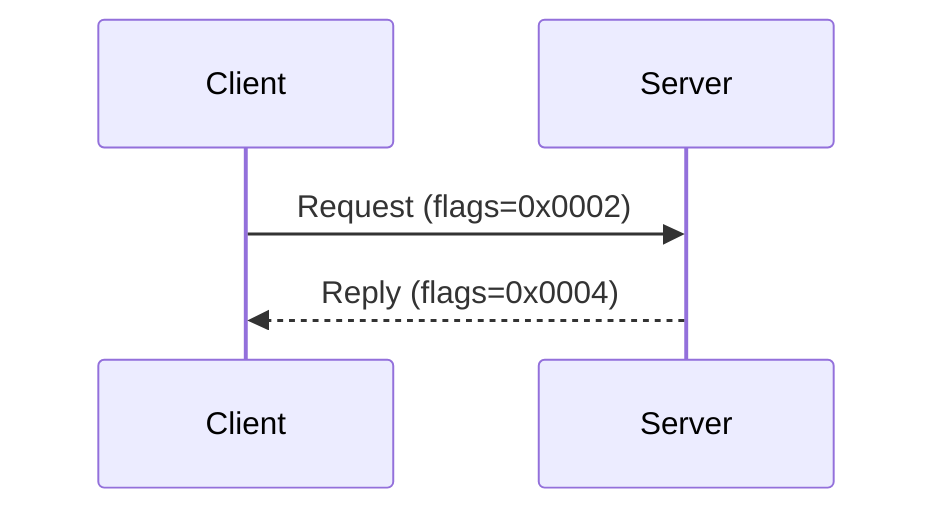
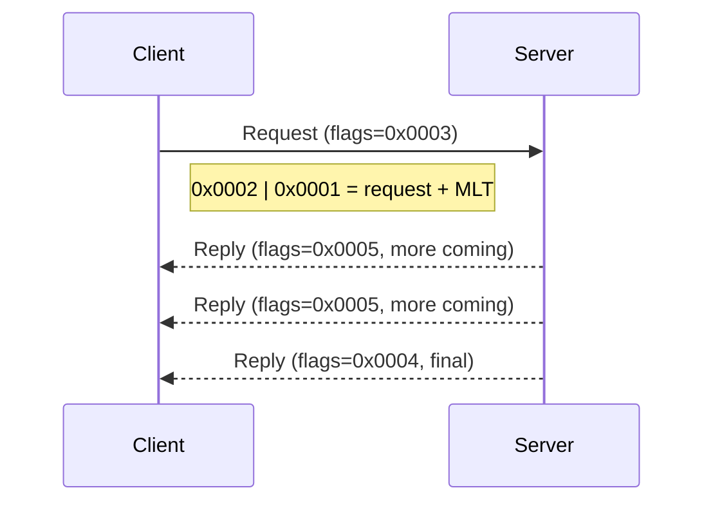

# Low-Level ACNET

This page documents the low-level ACNET protocol for advanced users who need to communicate directly with frontends or implement custom protocols.

## ACNET Concepts

When discussing ACNET, people generally refer to the entire control system infrastructure - protocols, frontends, and central services. Here we focus specifically on the **ACNET UDP packet protocol**.

**ACNET** is a UDP-based mesh protocol that passes messages between **tasks** running on **nodes**.

A **node** is a computer (physical or VM) that runs either:

- `acnetd` - the ACNET daemon (on central services and some frontends)
- Frontend application code (on VME crates, PLCs, etc.)

Each node has a unique **address** encoded as `trunk:node` (two bytes). All nodes maintain tables mapping node addresses to IP addresses.

A **task** is a named process that can send/receive ACNET messages. Task names are 6-character strings encoded using **RAD50** (a base-40 encoding that packs 6 chars into 32 bits).

## Packet Structure

ACNET packets have an 18-byte header followed by variable-length payload:

| Offset | Size | Endian | Field | Description |
|--------|------|--------|-------|-------------|
| 0 | 2 | LE | flags | Message type and control flags |
| 2 | 2 | LE | status | Status/error code (signed) |
| 4 | 2 | BE | server | Server node (trunk:node) |
| 6 | 2 | BE | client | Client node (trunk:node) |
| 8 | 4 | LE | serverTask | Server task name (RAD50) |
| 12 | 2 | LE | clientTaskId | Client task identifier |
| 14 | 2 | LE | id | Message/request ID |
| 16 | 2 | LE | length | Total packet length |
| 18+ | var | LE | data | Payload |

Note the mixed endianness: node addresses are big-endian, everything else is little-endian.

## Message Types

The `flags` field determines the message type:

| Type | Flag Value | Description |
|------|------------|-------------|
| USM | `0x0000` | Unsolicited message (no reply expected) |
| Request | `0x0002` | Request (expects reply) |
| Reply | `0x0004` | Reply to a request |
| Cancel | `0x0200` | Cancel an outstanding request |

Additional flag bits:

- `0x0001` (MLT) - Multiple replies expected/following
- Upper nibble - Reply sequence number (for detecting missed replies)

## Request/Reply Flow



For multiple-reply requests (MLT flag set):



## Node Addressing

Node addresses are 16-bit values: `(trunk << 8) | node`

Examples:

- `0x0A06` = trunk 10, node 6
- `0x09CC` = trunk 9, node 204

Trunk 230 (`0xE6`) is reserved for pseudo-nodes (open-access clients).

## RAD50 Encoding

Task names use RAD50, a base-40 encoding that fits 6 characters into 32 bits:

```python
from pacsys.acnet import rad50

encoded = rad50.encode("DPMD")    # -> 0x19001B8D
name = rad50.decode(0x19001B8D)   # -> "DPMD  " (note spaces)
```

Character set (40 chars): <code> ABCDEFGHIJKLMNOPQRSTUVWXYZ$.%0123456789</code>

## Status Codes

The `status` field uses facility-error encoding:

- Low byte: facility code (always positive)
- High byte: error code (signed)
- Negative = failure, zero = success, positive = status or warning (e.g., pending)

## Using pacsys.acnet

```python
from pacsys.acnet import AcnetPacket

packet = AcnetPacket.parse(raw_bytes)

if packet.is_reply():
    print(f"Reply from {packet.server_task_name}")
    print(f"Status: {packet.status}")
    print(f"Data: {packet.data.hex()}")
```

### Packet Classes

| Class | Description |
|-------|-------------|
| `AcnetPacket` | Base class - parse with `AcnetPacket.parse(data)` |
| `AcnetRequest` | Incoming request from another task |
| `AcnetReply` | Reply to a request we sent |
| `AcnetMessage` | Unsolicited message (no reply expected) |
| `AcnetCancel` | Cancel notification for an outstanding request |

### Constants

```python
from pacsys.acnet.constants import (
    ACNET_PORT,           # 6801 - UDP port
    ACNET_TCP_PORT,       # 6802 - TCP port (for acnetd)
    ACNET_HEADER_SIZE,    # 18 bytes

    # Message flags
    ACNET_FLG_USM,        # 0x0000 - Unsolicited message
    ACNET_FLG_REQ,        # 0x0002 - Request
    ACNET_FLG_RPY,        # 0x0004 - Reply
    ACNET_FLG_MLT,        # 0x0001 - Multiple reply
    ACNET_FLG_CAN,        # 0x0200 - Cancel
)
```

## Wire Format Notes

1. **No odd-length packets** - ACNET does not support odd-length payloads
2. **Byte swapping** - Data is little-endian with even/odd bytes swapped per word
3. **Multiple packets per datagram** - A single UDP datagram may contain multiple ACNET packets

The byte-swap rule means:

- 2-byte integers appear big-endian on the wire (after swap)
- 4-byte integers have "middle-endian" representation
- Strings like `"MISCBOOT"` appear as `"IMCSOBTO"` on the wire

## Common Tasks

| Task Name | Purpose |
|-----------|---------|
| DPMD | Data Pool Manager daemon |
| RETDAT | Return data (frontend) |
| SETDAT | Set data (frontend) |
| FTPMAN | Fast Time Plot manager (frontend) - see [FTPMAN Protocol](ftpman-protocol.md) |

## Further Reading

- ACNET Design Note 22 (internal Fermilab documentation)
- `pacsys/acnet/` source code for implementation details
