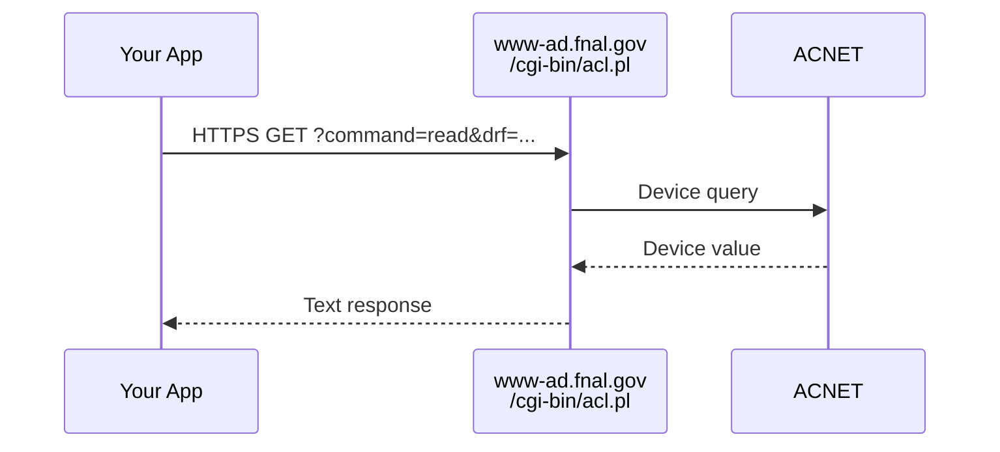

# ACL

HTTP-based read-only access via the ACL CGI script. ACL is a separate service on the control system (not DPM). No authentication required.



## Characteristics

- **No authentication**: Anyone can read
- **Read-only**: No write or streaming support
- **Simple**: Just HTTP requests. No writes. No streaming.
- **Slower**: HTTP overhead vs binary protocol

## Usage

```python
import pacsys

with pacsys.acl() as backend:
    value = backend.read("M:OUTTMP")
    readings = backend.get_many(["M:OUTTMP", "G:AMANDA"])
```

## When to Use

- Quick one-off reads when there are difficulties installing dependencies
