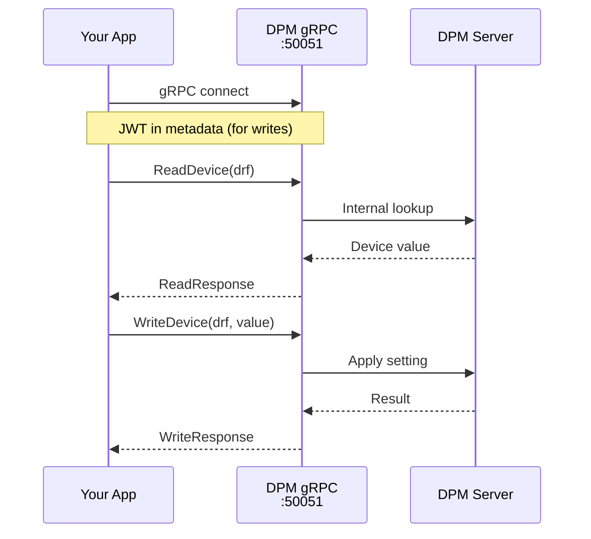

# DPM/gRPC

Modern gRPC interface to DPM. Will be default in the future. Uses Protocol Buffers for serialization.



## Characteristics

- **Strongly typed**: Protobuf schema with clear message types
- **JWT authentication**: Token-based auth for writes
- **Reachability**: Only accessible on controls network

## Usage

```python
import pacsys
from pacsys import JWTAuth

# Read-only
with pacsys.grpc() as backend:
    value = backend.read("M:OUTTMP")

# With JWT authentication - automatic authentication is NOT yet implemented/available
auth = JWTAuth(token="eyJ...")  # Or set PACSYS_JWT_TOKEN env var
with pacsys.grpc(auth=auth) as backend:
    result = backend.write("M:OUTTMP", 72.5)
```

## Configuration

| Parameter | Default | Environment Variable |
|-----------|---------|---------------------|
| `host` | dce08.fnal.gov | - |
| `port` | 50051 | - |
| `auth` | None | `PACSYS_JWT_TOKEN` |

## Write Permissions (JWT)

JWT tokens are introspected server-side via a Keycloak endpoint. Your token's `realm_access.roles` determine which devices you can write to. Roles are mapped to ACNET console classes (e.g. `MCR`, `ASTA`, ...). Same bitwise check logic is applied as for DPM/HTTP.
