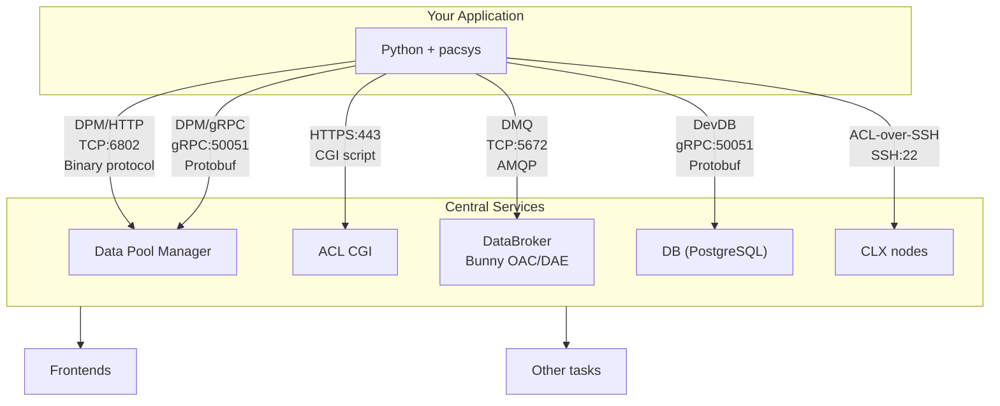
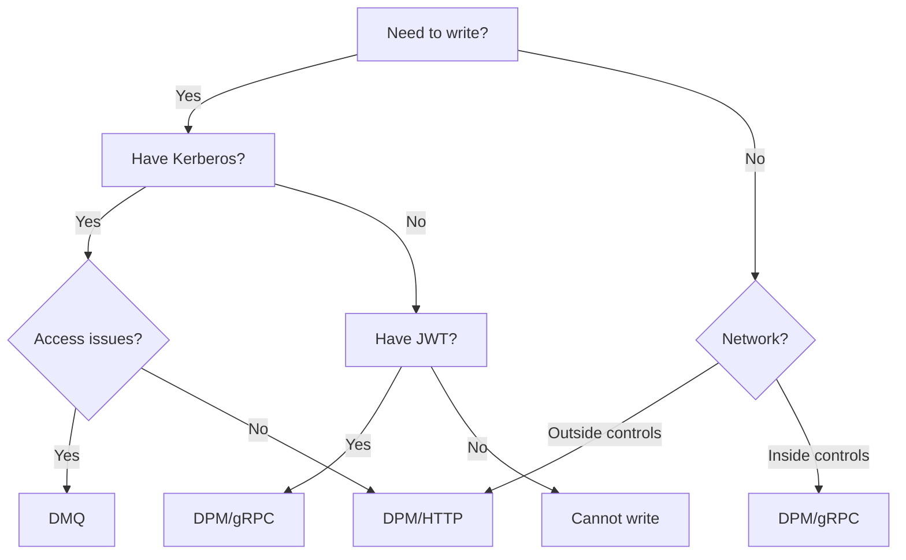

# Backends

## Overview

pacsys provides multiple backends which talk to various 'central services'. The DPM backends connect to the DPM server, DMQ talks to DataBroker/Bunny OAC/DAE, etc.



## Backend Comparison

| Feature | DPM/HTTP | DPM/gRPC | DMQ | ACL |
|---------|:--------:|:--------:|:---:|:---:|
| **Read** | ✓ | ✓ | ✓ | ✓ |
| **Write** | ✓ | ✓ | ✓ | - |
| **Stream** | ✓ | ✓ | ✓ | - |
| **Auth** | Kerberos¹ | JWT | Kerberos² | None |
| **Permissions** | Role/class | Role | Console class | N/A |
| **Protocol** | Custom binary (PC) | gRPC/Protobuf | AMQP/SDD | HTTP/CGI |
| **Port** | 6802 | 50051 | 5672 | 443 |
| **Factory** | `pacsys.dpm()` | `pacsys.grpc()` | `pacsys.dmq()` | `pacsys.acl()` |

¹ DPM/HTTP: Kerberos required for writes only, reads work anonymously
² DMQ: Kerberos required for ALL operations (reads, writes, streaming)

---

## Implicit Write Conversion

All write-capable backends (DPM/HTTP, DPM/gRPC, DMQ) automatically prepare DRF strings for writing when you call `write()`:

- **READING → SETTING**: `M:OUTTMP` becomes `M:OUTTMP.SETTING@N`
- **STATUS → CONTROL**: `M:OUTTMP.STATUS` becomes `M:OUTTMP.CONTROL@N`
- **Already correct**: SETTING, CONTROL, ANALOG, DIGITAL are preserved (just `@N` is forced)

The `@N` ("never") event tells the server not to send periodic data back - writes are fire-and-confirm, not subscriptions.

---

## Choosing a Backend



### Recommendations

| Scenario | Backend |
|----------|---------|
| General use (read/write/stream) | **DPM/HTTP** |
| High-performance with JWT | **DPM/gRPC** |
| Full access via RabbitMQ | **DMQ** |
| Quick read-only checks | **ACL** |
| No auth available, read-only | **ACL** |

---

## Multiple Backends

You can use different backends simultaneously:

```python
import pacsys
from pacsys import KerberosAuth

# Quick read via ACL (no auth needed)
with pacsys.acl() as acl:
    current = acl.read("M:OUTTMP")

# Write via DPM/HTTP with auth
with pacsys.dpm(auth=KerberosAuth(), role="testing") as dpm:
    dpm.write("M:OUTTMP", current + 1.0)

# Or write via DMQ (no role needed, just Kerberos)
with pacsys.dmq(auth=KerberosAuth()) as dmq:
    dmq.write("M:OUTTMP", current + 1.0)

# Stream via DPM/HTTP
with pacsys.dpm() as dpm:
    with dpm.subscribe(["M:OUTTMP@p,1000"]) as stream:
        for reading, _ in stream.readings(timeout=30):
            print(reading.value)

# Or stream via DMQ
with pacsys.dmq(auth=KerberosAuth()) as dmq:
    with dmq.subscribe(["M:OUTTMP@p,1000"]) as stream:
        for reading, _ in stream.readings(timeout=30):
            print(reading.value)
```
